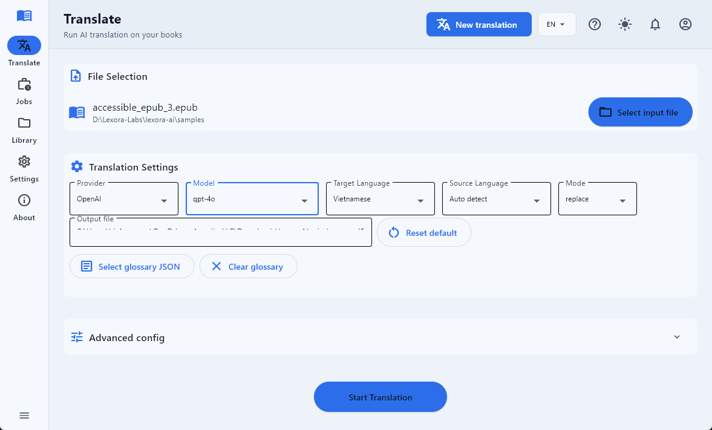

# Lexora AI

Lexora AI is an open-source, AI-assisted eBook translation tool. It helps you translate EPUB, MOBI, Word, and Markdown while keeping structure and formatting as intact as the pipeline allows.

You can use it in two ways:

- **Desktop app (Flet UI)** — translate with a visual workflow, job queue, and settings.
- **Command-line interface (CLI)** — scriptable runs for automation and CI.

---

## Install from a GitHub Release (recommended)

Prebuilt installers and archives are attached to each tagged release (for example `v0.1.1`).

1. Open **[Releases](https://github.com/Lexora-Labs/lexora-ai/releases)** and download the build for your OS.

### Windows


| Asset                        | What it is                                                                                        |
| ---------------------------- | ------------------------------------------------------------------------------------------------- |
| `LexoraAI-windows-amd64.zip` | Zip of the packaged app (recommended if SmartScreen is strict). Extract, then run `LexoraAI.exe`. |
| `LexoraAI-windows-amd64.msi` | Per-machine WiX installer (installs under Program Files).                                         |


If Windows SmartScreen warns the first time, use **More info → Run anyway** (until builds are code-signed).

### macOS


| Asset                      | What it is                                                                           |
| -------------------------- | ------------------------------------------------------------------------------------ |
| `LexoraAI-macos-arm64.zip` | Zip containing `LexoraAI.app`. Unzip, then drag **Lexora AI** into **Applications**. |


Current CI builds target **Apple Silicon (arm64)** runners. On Intel Macs you may need a separate x64 build in a future release.

### After install

1. Start **Lexora AI** (from Start Menu, desktop shortcut, or `LexoraAI.exe`).
2. Open **Settings** and add at least one provider API key **or** place a `.env` file next to the app (see [Configuration](#configuration)).
3. Use **Translate** to pick a book and run a job; monitor progress in **Jobs**.

Default output files go under a `**library`** folder in the app’s working directory, named like:

`{original_stem}_{provider}_{target_lang}{extension}`

If that name already exists, a suffix  `(1)`,  `(2)`, … is added before the extension.

---

## Developer install (from source)

Use this when you are contributing or want the latest `main` without waiting for a release.

```bash
python -m venv .venv
# Windows: .\.venv\Scripts\activate
# macOS/Linux: source .venv/bin/activate

pip install -r requirements.txt
pip install -e .
```

Run the UI:

```bash
python run_ui.py              # browser + server (default)
python run_ui.py --no-browser # desktop window only
```

Run the CLI (see `lexora translate --help` for all flags):

```bash
lexora translate input.epub output.epub --target vi --service openai
```

---

## Configuration

Credentials and defaults can come from **two places** (both are supported):

### 1. `.env` file (CLI and UI)

- Copy `**.env.example`** to `**.env`** in the working directory (next to the app when packaged, or repo root when developing).
- Fill in keys for the providers you use. The CLI loads `.env` automatically; the UI also respects environment variables.

See `**.env.example**` for every variable name (OpenAI, Azure OpenAI, Azure AI Foundry, Gemini, Anthropic, Qwen, optional UI port, etc.).

### 2. In-app **Settings** (UI)

- **Provider API keys** can be saved in the app (encrypted local store, with env still taking precedence where applicable).
- **Cache** scope/path, theme, language, and related UI preferences are controlled from Settings.

**Practical order:** if a value exists in the OS environment or `.env`, it typically wins over UI-stored secrets for the same key—this keeps CI and power-user setups predictable.

### Translate tab — per-job configuration

Everything below lives on the **Translate** screen and applies only to the run you start (or queue) from there. **Cache** behavior for that run still comes from **Settings** (scope, path, disable cache, clear cache before run)—the Translate tab does not duplicate those controls.

**Translation settings** (main card)

- **Input file** — EPUB/MOBI/Word/Markdown via the file picker (desktop/local paths; browser-hosted UI cannot translate arbitrary local paths).
- **Provider** and **Model** — must match a provider you configured under Settings or `.env`.
- **Target language** and **Source language** — source can be **Auto detect** or a fixed language.
- **Mode** — **replace** (translate in place) or **bilingual** (emit bilingual layout where the pipeline supports it).
- **Output file** — leave blank to use the automatic `library/…` naming pattern shown in the hint, or set a full path; **Reset default** restores the auto path for the current inputs.
- **Glossary** — **Select glossary JSON** / **Clear glossary** appear here; glossary application is **not reliable yet** (see [Limitations](#limitations-current)).

**Advanced config** (collapsible section below Translation settings)

Use the expand control to show tuning options that mirror CLI-style flags:

- **Limit docs** — cap how many EPUB spine documents are processed (empty = no cap).
- **Start doc** / **End doc** — optional 1-based inclusive range inside the EPUB document list (empty = from start / through end). Must satisfy `start ≤ end` when both are set.
- **Chunk size** — maximum characters per translation chunk (default `1200`).
- **Context window** — extra surrounding characters carried across chunk boundaries (default `0`).
- **Structured EPUB batch** — when enabled, uses structured batching for EPUBs; **Structured max chars** caps payload size per batch (default `8000`).
- **Report path (optional)** — if set, after the run finishes the app writes a JSON **run report** (command, languages, provider, paths, timing, token usage, and related metadata) to that path.

For deeper behavior (document selection, structured batching, reports), see `**docs/translation-logic.md`** and `**lexora translate --help`**.

---

## Screenshots

Add images under `**docs/screenshots/**` and link them here (filenames are suggestions).


| Area      | Suggested file                   |
| --------- | -------------------------------- |
| Translate | `docs/screenshots/translate.png` |
| Jobs      | `docs/screenshots/jobs.png`      |
| Settings  | `docs/screenshots/settings.png`  |


```markdown

```

---

## Limitations (current)

- **Not code-signed by default** — first launch may show SmartScreen (Windows) or Gatekeeper (macOS) warnings until you establish trust or sign binaries.
- **EPUB presentation** — complex CSS or publisher-specific layouts may not match the source pixel-perfect; see open issues and `docs/` for pipeline notes.
- **Provider and model behavior** — quality, speed, and cost depend on the model, rate limits, and document size; very large books need patience and may hit provider quotas.
- **Platform coverage** — release builds follow what CI produces (today: **Windows x64** bundle + MSI; **macOS arm64** `.app` in a zip). Other arches/OSes are not guaranteed.
- **Claude, Gemini, and Qwen** — not yet fully exercised in end-to-end testing; expect rough edges compared to OpenAI/Azure paths.
- **Library** — in-app library section is not implemented yet; outputs still land under the configured `**library`** folder on disk.
- **Glossary** — glossary option in the UI is present but not functional yet.

---

## Roadmap (next releases)

Planned direction (subject to prioritization):

- **Translation context, instructions, and glossary** — richer per-job controls (custom context, translator instructions, and a working glossary path in UI and pipeline).
- **Image translation** — translate text inside figures/illustrations in ebooks where technically feasible, with safe fallbacks when OCR or layout is ambiguous.
- **First-class Gemini & Claude UX** — smoother model selection, clearer setup, and validation in the UI for Google Gemini and Anthropic Claude paths.
- **Bilingual mode in the UI** — expose replace vs bilingual output as a first-class per-job control end-to-end (aligned with the CLI options).

---

## Usage (quick reference)

### UI

- **Translate** — pick file, provider, model, languages, output path (glossary UI is not wired yet; see [Limitations](#limitations-current)).
- **Jobs** — queue, cancel/re-run, logs, open output folder/file.
- **Settings** — keys, cache, appearance, language.

### CLI

Common patterns:

```bash
lexora translate book.epub out.epub --target vi --service openai
lexora translate book.epub out.epub --target vi --service gemini --structured-epub-batch --limit-docs 1
```

For structured EPUB batching, cache scopes, and document ranges, see `**docs/translation-logic.md**` and `**lexora translate --help**`.

---

## Test inputs (sample EPUBs)

For manual runs, prefer **IDPF EPUB 3 reference samples** (clear license).

- Catalog: [EPUB 3 Samples (IDPF)](https://idpf.github.io/epub3-samples/30/samples.html)
- Put `.epub` files under `**samples/`** (see `samples/README.md`).
- Details: [docs/testing-epub-samples.md](docs/testing-epub-samples.md)

---

## Supported formats & providers

**Formats:** EPUB (`.epub`), MOBI (`.mobi`), Word (`.docx`, `.doc`), Markdown (`.md`).

**Providers (examples):** OpenAI, Azure OpenAI, Azure AI Foundry, Gemini, Anthropic (Claude), Qwen — see `.env.example` and [docs/provider-api-key-guide.md](docs/provider-api-key-guide.md).

---

## Docs

- [docs/provider-api-key-guide.md](docs/provider-api-key-guide.md) — API keys and provider setup
- [docs/testing-epub-samples.md](docs/testing-epub-samples.md) — sample EPUBs and licensing
- [docs/translation-logic.md](docs/translation-logic.md) — pipeline behavior
- [docs/translation-run-contract.md](docs/translation-run-contract.md) — run/report contract
- [docs/ui-data-model.md](docs/ui-data-model.md) — UI job model
- [docs/todo-list.md](docs/todo-list.md) — planned work index

---

## Contributing

Pull requests are welcome. For local development, use `pip install -e .` and run tests as you change code.

---

## License

Licensed under the **GNU Affero General Public License v3.0 (AGPL-3.0)** — see `LICENSE`.